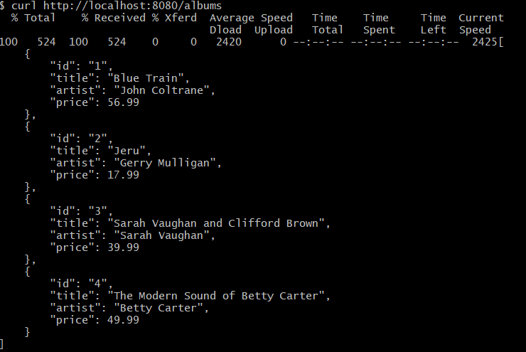
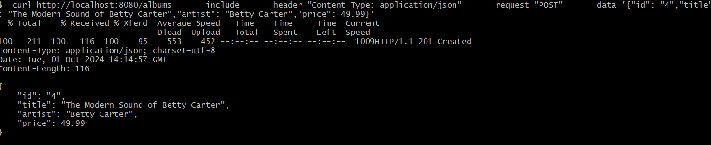

# REST API USING GIN FRAMEWORK

A simple REST API that exposes 3 endpoints to add and retrieve music albums as specified in this [official tutorial](https://go.dev/doc/tutorial/web-service-gin).


## Built With

- [Golang](https://golang.org/) 1.22 or above
- [Gin Web Framework](https://github.com/gin-gonic/gin)


## Getting Started

### Prerequisites
- go 1.22 or above

### Installation

1. Run the command to clone the repository locally -

  ```bash
  https://github.com/kesarihardik/alum-service.git
  ```

2. Run the command to build the project from the repository.

```bash
go build
```

3. Finally, run the service using
```bash
go run .
```

## Usage

1. Fetch albums
 
 

2. Save an album

 

3. Get a specific album

 


## Documentation 

This project follows this [tutorial](https://go.dev/doc/tutorial/web-service-gin).